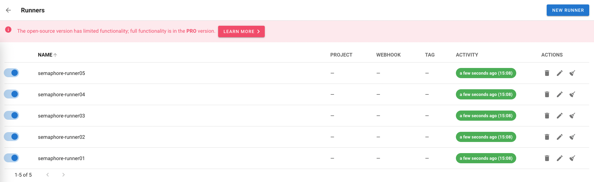
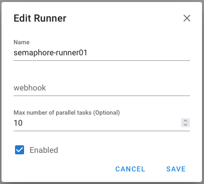

# Centralized Deployment Guide

This guide explains how to use the centralized deployment system to manage Docker containers across multiple VMs.

## Prerequisites

Before starting the deployment, ensure the following prerequisites are met:

### Local Machine Requirements
- **Operating System**: Linux/MacOS (or WSL on Windows)
- **Docker**: Version 20.10 or higher
- **Docker Compose**: Version 2.0 or higher
- **SSH Client**: OpenSSH client installed
- **yq**: YAML query processor v4.x
  ```bash
  # Install yq on Linux
  sudo wget -qO /usr/local/bin/yq https://github.com/mikefarah/yq/releases/latest/download/yq_linux_amd64
  sudo chmod +x /usr/local/bin/yq
  
  # Verify installation
  yq --version
  ```
- **rsync**: For file synchronization
  ```bash
  # Install on Ubuntu/Debian
  sudo apt-get install rsync
  
  # Verify installation
  rsync --version
  ```
- **make**: Build automation tool (optional, for using Makefile shortcuts)
  ```bash
  sudo apt-get install build-essential
  ```

### Remote VM Requirements
Each remote VM should have:
- **Operating System**: Ubuntu 20.04+ or similar Linux distribution
- **Docker**: Version 20.10 or higher
- **Docker Compose**: Version 2.0 or higher
- **SSH Server**: OpenSSH server running
- **User Account**: Non-root user with sudo privileges and docker group membership
- **Network Access**: Ability to reach control plane VM and target devices
- **Disk Space**: Minimum 20GB free space for Docker images and data

### Network Requirements
- SSH access (port 22) between local machine and all VMs
- HTTP access to control plane (port 3001) from all runner VMs
- VPN access if VMs are on private network
- Firewall rules allowing Docker container communication

## Setting Up Remote VMs

### 1. Configure SSH Key Access

Generate SSH key pair on your local machine (if not already done):

```bash
# Generate SSH key pair (if you don't have one)
ssh-keygen -t rsa -b 4096 -C "your_email@example.com"

# Follow prompts to save the key (default: ~/.ssh/id_rsa)
```

Copy SSH public key to each remote VM:

```bash
# Copy to VM1 (Control Plane)
ssh-copy-id ubuntu@10.221.80.101

# Copy to VM2 (Runners)
ssh-copy-id root@10.87.94.51

# Alternative: Manual copy if ssh-copy-id doesn't work
cat ~/.ssh/id_rsa.pub | ssh ubuntu@10.221.80.101 "mkdir -p ~/.ssh && cat >> ~/.ssh/authorized_keys"
```

Test SSH access (should not prompt for password):

```bash
ssh ubuntu@10.221.80.101
ssh root@10.87.94.51
```

### 2. Install Docker on Remote VMs

Run these commands on each remote VM:

```bash
# Update package index
sudo apt-get update

# Install prerequisites
sudo apt-get install -y apt-transport-https ca-certificates curl software-properties-common

# Add Docker GPG key
curl -fsSL https://download.docker.com/linux/ubuntu/gpg | sudo apt-key add -

# Add Docker repository
sudo add-apt-repository "deb [arch=amd64] https://download.docker.com/linux/ubuntu $(lsb_release -cs) stable"

# Install Docker
sudo apt-get update
sudo apt-get install -y docker-ce docker-ce-cli containerd.io

# Install Docker Compose
sudo curl -L "https://github.com/docker/compose/releases/download/v2.23.0/docker-compose-$(uname -s)-$(uname -m)" -o /usr/local/bin/docker-compose
sudo chmod +x /usr/local/bin/docker-compose

# Verify installation
docker --version
docker-compose --version
```

### 3. Configure User Permissions

Add your user to the docker group on each VM:

```bash
# On each remote VM
sudo usermod -aG docker $USER

# Log out and log back in for changes to take effect
exit
ssh ubuntu@10.221.80.101

# Verify docker access without sudo
docker ps
```

### 4. Create Required Directories

On each remote VM, ensure base directories exist:

```bash
# On control plane VM (10.221.80.101)
mkdir -p /home/ubuntu/workspace

# On runner VMs (if using different base path)
mkdir -p /root/workspace
```

## Setting Up deployment-config.yml

The `deployment-config.yml` file is the single source of truth for your infrastructure topology.

### Configuration Structure

```yaml
cluster_name: "telemetry-prod"  # Used for naming runners

deployment:
  control_plane:
    vm_host: 10.221.80.101
    services:
      - semaphore
      - postgres
      - prometheus
      - grafana
      - pushgateway
    compose_profile: control
    description: "Control plane with Semaphore UI and monitoring"
  
  runners:
    - name: runner01
      vm_host: 10.221.80.101
      compose_profile: runner01
      description: "Handles XAI and Regression1 devices"
    
    - name: runner02
      vm_host: 10.87.94.51
      compose_profile: runner02
      description: "Handles Regression2 devices"
    
    - name: runner03
      vm_host: 10.87.94.51
      compose_profile: runner03
      description: "Handles GPU fabric cluster devices"
    
    - name: runner04
      vm_host: 10.87.94.51
      compose_profile: runner04
      description: "Handles Shard 4 devices"
    
    - name: runner05
      vm_host: 10.87.94.51
      compose_profile: runner05
      description: "Handles Shard 5 devices"

vm_details:
  - host: 10.221.80.101
    user: ubuntu
    base_path: /home/ubuntu
    profiles:
      - control
      - runner01
  
  - host: 10.87.94.51
    user: root
    base_path: /root
    profiles:
      - runner02
      - runner03
      - runner04
      - runner05
```

### Configuration Parameters

- **cluster_name**: Prefix for runner names (e.g., `telemetry-prod-runner01`)
- **vm_host**: IP address or hostname of the VM
- **user**: SSH username for the VM
- **base_path**: Base directory path on the VM where code will be deployed
- **compose_profile**: Docker Compose profile name for this service/runner

### Customizing for Your Environment

1. **Update VM IP addresses** to match your infrastructure
2. **Update SSH usernames** based on your VM user accounts
3. **Update base paths** if you want code in different locations
4. **Update cluster_name** to match your environment
5. **Add/remove runners** as needed for your device shards

## Deploying Control Plane

The control plane hosts Semaphore UI, Prometheus, Grafana, and PostgreSQL database.

### Step 1: Clone Repository and Navigate

```bash
cd /home/ubuntu/workspace
git clone <your-repo-url> telemetry
cd telemetry/infrastructure
```

### Step 2: Configure Environment Variables

Edit `env-files/.env` and update with your values:

```bash
vim env-files/.env
```

```bash
# Environment variables for all services

# Control plane configuration
SEMAPHORE_WEB_ROOT=http://10.221.80.101:3001
RUNNER_TOKEN=runnertoken12345  # Will be used to register runners

# Prometheus Pushgateway URL (used by runners to push metrics)
PROMETHEUS_PUSHGATEWAY=http://10.221.80.101:9091

# Runner tokens (will be populated after runner registration)
RUNNER01_TOKEN=
RUNNER02_TOKEN=
RUNNER03_TOKEN=
RUNNER04_TOKEN=
RUNNER05_TOKEN=

# Web roots (should point to control plane)
RUNNER01_WEB_ROOT=http://10.221.80.101:3001
RUNNER02_WEB_ROOT=http://10.221.80.101:3001
RUNNER03_WEB_ROOT=http://10.221.80.101:3001
RUNNER04_WEB_ROOT=http://10.221.80.101:3001
RUNNER05_WEB_ROOT=http://10.221.80.101:3001
```

**Note**: The `RUNNER*_WEB_ROOT` environment variables configure where each runner connects to the Semaphore control plane. These are defined in the `.env` file and referenced in `docker-compose.yml`, not in `deployment-config.yml`.

### Step 3: Deploy Control Plane

```bash
# Using Makefile
make deploy-control

# Or using deploy.sh directly
./deploy.sh deploy control
```

This will:
1. Start PostgreSQL database
2. Start Semaphore UI on port 3001
3. Start Prometheus on port 9090
4. Start Grafana on port 3000
5. Start Pushgateway on port 9091

### Step 4: Verify Control Plane

```bash
# Check running containers
docker ps

# Check logs
make logs-control
# Or
./deploy.sh logs control

# Access Semaphore UI
# Open browser to: http://10.221.80.101:3001
# Default credentials: admin / changeme
```

## Registering New Runners

Each runner needs to be registered with the control plane before it can accept tasks.

### Step 1: Create SSH Private Key for Runner

Generate a unique private key for each runner:

```bash
cd /home/ubuntu/workspace/telemetry/infrastructure

# For Runner01
openssl genrsa -out mounts/semaphore_runners/runner01.key.pem 2048
chmod 644 mounts/semaphore_runners/runner01.key.pem

# For Runner02
openssl genrsa -out mounts/semaphore_runners/runner02.key.pem 2048
chmod 644 mounts/semaphore_runners/runner02.key.pem

# For Runner03
openssl genrsa -out mounts/semaphore_runners/runner03.key.pem 2048
chmod 644 mounts/semaphore_runners/runner03.key.pem

# For Runner04
openssl genrsa -out mounts/semaphore_runners/runner04.key.pem 2048
chmod 644 mounts/semaphore_runners/runner04.key.pem

# For Runner05
openssl genrsa -out mounts/semaphore_runners/runner05.key.pem 2048
chmod 644 mounts/semaphore_runners/runner05.key.pem
```

### Step 2: Register Runner with Control Plane

#### 2.1. Enter the Control Plane Container

```bash
docker exec -it semaphore bash
```

#### 2.2. Run Runner Setup Command

```bash
# For Runner01 (example)
semaphore runner setup --config /etc/semaphore_runners/runner01-config.json
```

#### 2.3. Answer Interactive Questions

The setup will prompt you with the following questions:

```
Semaphore server URL: http://10.221.80.101:3001
(This should be the URL where your control plane is running)

Do you want to store token in external file? (yes/no) (default no): no

Do you have runner's token? (yes/no) (default no): yes

Enter valid runner token: runnertoken12345
(This is the RUNNER_TOKEN from your .env file)

Do you have runner's private key file? (yes/no) (default no): yes

Enter path to the private key file: /etc/semaphore_runners/runner01.key.pem
```

#### 2.4. Verify Successful Registration

Successful execution will show:

```
Configuration written to /etc/semaphore_runners/runner01-config.json
Loading config
Validating config
INFO[0063] Registering a new runner

Re-launch this program pointing to the configuration file
./semaphore runner start --config /etc/semaphore_runners/runner01-config.json

To run as daemon:
nohup ./semaphore runner start --config /etc/semaphore_runners/runner01-config.json &
```

#### 2.5. Check Generated Configuration

Exit the container and view the generated config:

```bash
exit  # Exit from semaphore container

# View generated config
cat mounts/semaphore_runners/runner01-config.json
```

The config will look like:

```json
{
    "web_host": "http://10.221.80.101:3001",
    "runner": {
        "token": "Jfd6dk14xjC/0sKZK/jnkTp2BHF32oFwrVjP3HrbUKo=",
        "private_key_file": "/etc/semaphore_runners/runner01.key.pem"
    }
}
```

**Important**: The `token` value should be **encrypted** (base64-encoded string with random characters like shown above). If the token appears as plain text (e.g., "runnertoken12345"), this indicates a potential issue with the runner registration process. The control node should encrypt the token during registration using the private key. If you see an unencrypted token, verify:
- The private key file has correct permissions (644 or 777)
- The private key file path is correct in the registration command
- Re-run the registration process if needed

### Step 3: Update Environment Variables

Copy the encrypted token from the config file and add it to your `.env` file:

```bash
vim env-files/.env
```

Update the corresponding token:

```bash
# For Runner02
RUNNER01_TOKEN=/V9QNc6uoHMeuUXnjZfm73mg5SAd1cZ1cX+EE8dN3do=
```

### Step 4: Add Runner to docker-compose.yml

If this is a new runner (not runner01-05), add a new service definition:

```yaml
  # Runner06 (Example)
  # docker compose --profile runner06 up -d
  semaphore-runner04:
    image: semaphoreui/runner:v2.16.47
    container_name: semaphore-runner06
    profiles:
      - runner06
      - all-runners
      - all
    # user: "1000:1000"
    environment:
      SEMAPHORE_WEB_ROOT: ${RUNNER06_WEB_ROOT}
      SEMAPHORE_RUNNER_TOKEN: ${RUNNER06_TOKEN}
      SEMAPHORE_RUNNER_PRIVATE_KEY_FILE: /etc/semaphore_runners/runner06.key.pem
      SEMAPHORE_RUNNER_NAME: ${RUNNER_NAME:-semaphore-runner06}
      SEMAPHORE_RUNNER_TAGS: semaphore-runner06,shard6,custom-tag
      ANSIBLE_HOST_KEY_CHECKING: 'false'
      HOME: /home/semaphore
      SEMAPHORE_FORWARDED_ENV_VARS: '["SEMAPHORE_RUNNER_NAME"]'
      PROMETHEUS_PUSHGATEWAY: ${PROMETHEUS_PUSHGATEWAY}
    networks:
      - monitoring
    restart: unless-stopped
    volumes:
      - ${TELEMETRY_BASE}/ansible/requirements.txt:/etc/semaphore/requirements.txt:ro
      - ${TELEMETRY_BASE}/infrastructure/mounts/semaphore_runners:/etc/semaphore_runners
      - ${TELEMETRY_BASE}/infrastructure/mounts/output:/tmp/semaphore/output
      - ${TELEMETRY_BASE}/infrastructure/mounts/raw_ml_data:/tmp/semaphore/raw_ml_data
```

Key fields to configure:
- `SEMAPHORE_WEB_ROOT`: URL to control plane
- `SEMAPHORE_RUNNER_TOKEN`: Encrypted token from registration
- `SEMAPHORE_RUNNER_PRIVATE_KEY_FILE`: Path to runner's private key
- `PROMETHEUS_PUSHGATEWAY`: URL to Prometheus Pushgateway for metrics (inherited from .env)

### Step 5: Deploy the Runner

The deployment script will copy only the necessary files for the specific runner:
- `docker-compose.yml`
- `env-files/.env`
- `ansible/requirements.txt`
- Runner-specific private key (e.g., `runner2.key.pem` for runner02)
- Runner-specific config (e.g., `runner2-config.json` for runner02)

```bash
# For local runner (on same VM as control plane)
make deploy-runner01
# Or
./deploy.sh deploy runner01

# For remote runner
make deploy-runner02
# Or
./deploy.sh deploy runner02

# Deploy Runner03
make deploy-runner03

# Deploy Runner04
make deploy-runner04

# Deploy Runner05
make deploy-runner05
```

**Note**: Deploying one runner will not affect other runners' keys or configurations. Each deployment only copies files specific to that runner.

### Step 6: Verify Runner Connection

Check runner logs to confirm successful connection:

```bash
# View runner logs
make logs-runner02
# Or
./deploy.sh logs runner02
```

Successful connection shows:

```
Starting semaphore runner
Loading config
Validating config
Runner connected
```

**Troubleshooting: Runner Not Found Error**

If you see the following error in the runner logs:

```
semaphore-runner01  | time="2026-02-06T07:07:04Z" level=error msg="error status code" action="send request" context="checking new jobs" error="the server returned error 404: Runner not found" type=action
```

This indicates a potential issue with the runner token. To resolve:

1. Verify the token in `mounts/semaphore_runners/runner01-config.json` (or respective runner config)
2. Ensure this token is correctly copied to `env-files/.env` for the corresponding runner:
   - Runner01: `RUNNER01_TOKEN` should match token from `runner01-config.json`
   - Runner02: `RUNNER02_TOKEN` should match token from `runner02-config.json`
   - And so on for other runners
3. Redeploy the runner after updating the `.env` file:
   ```bash
   make deploy-runner01
   # Or for other runners: make deploy-runner02, etc.
   ```

### Step 7: Verify in Semaphore UI

1. Open Semaphore UI: http://10.221.80.101:3001
2. Navigate to **Settings** → **Runners**
3. You should see your registered runner listed with status "Connected"


Once all runners are successfully connected and active, they will appear in the Semaphore UI with the **Activity** column showing "a few seconds ago", indicating they are actively polling for tasks:



### Step 8: Configure Runner Settings in Semaphore UI

After registration, configure the runner for optimal operation:

1. Open Semaphore UI: http://10.221.80.101:3001
2. Navigate to **Settings** → **Runners**
3. Click on the newly registered runner to open the edit page
4. Update the following settings:
   - **Name**: Enter the runner name (e.g., `semaphore-runner01`, `semaphore-runner02`, etc.)
   - **Max Parallel Tasks**: Set to `10` (or adjust based on your needs)
   - **Enabled**: Check the **Enabled** checkbox
5. Click **Save** to apply the changes



**Purpose:**
- **Easy Identification**: The runner name helps identify which runner is which in the UI
- **Task Capacity**: Max parallel tasks controls how many jobs the runner can handle simultaneously
- **Ready State**: Enabling the runner makes it ready to accept and execute tasks

Repeat this step for each runner you register (runner01 through runner05).

## Next Steps: Configure Semaphore Projects and Tasks

Once all runners are deployed and connected, proceed to configure Semaphore projects, inventories, and task templates:

📖 **[Semaphore Configuration Guide](SEMAPHORE_CONFIGURATION.md)** - Complete step-by-step guide for:
- Creating projects in Semaphore UI
- Configuring key stores for vault passwords
- Setting up inventories for each device shard
- Creating task templates with runner assignments
- Scheduling automated telemetry collection runs

This guide covers the complete Semaphore UI setup needed to start collecting telemetry data from your Junos devices.

## System Architecture

The deployment system consists of:
- **docker-compose.yml** - Service definitions with profiles
- **deployment-config.yml** - VM topology and runner mappings
- **deploy.sh** - Centralized deployment script
- **env-files/.env** - Environment variables for all services

### VM Topology
```
VM1 (10.221.80.101):
  - Control Plane (Semaphore UI, Prometheus, Grafana, Postgres)
  - Runner01 (Shard1: XAI, Regression1)

VM2 (10.87.94.51):
  - Runner02 (Shard2: Regression2)
  - Runner03 (Shard3: GPU Fabric)
  - Runner04 (Shard4)
  - Runner05 (Shard5)
```

### Runner to Shard Mapping
```
semaphore-runner01 → inventory-shard1.yaml (XAI, Regression1)
semaphore-runner02 → inventory-shard2.yaml (Regression2)
semaphore-runner03 → inventory-shard3.yaml (GPU Fabric Cluster)
semaphore-runner04 → inventory-shard4.yaml (Shard 4)
semaphore-runner05 → inventory-shard5.yaml (Shard 5)
```

### Configuration Variables

#### PROMETHEUS_PUSHGATEWAY
The `PROMETHEUS_PUSHGATEWAY` environment variable configures where runners push telemetry metrics. This is defined in `.env` and passed to runner containers, which then expose it to Ansible playbooks.

- **Location**: `infrastructure/env-files/.env`
- **Default**: `http://10.221.80.101:9091`
- **Usage**: Ansible playbook reads via `lookup('env', 'PROMETHEUS_PUSHGATEWAY')`
- **Purpose**: Allows runners to push metrics to Prometheus Pushgateway for monitoring

To change the pushgateway URL:
1. Edit `infrastructure/env-files/.env`
2. Update `PROMETHEUS_PUSHGATEWAY=http://<new-host>:<port>`
3. Redeploy runners: `make deploy-all-runners`

**Note**: Remote runners must use the IP address of the control plane VM (not hostname) since they run in different Docker networks and cannot resolve local hostnames.

## Quick Start

### 1. Deploy Control Plane
```bash
cd /home/ubuntu/workspace/telemetry/infrastructure
./deploy.sh deploy control
```

### 2. Deploy All Runners
```bash
./deploy.sh deploy all-runners
```

### 3. Check Status
```bash
./deploy.sh status
```

### 4. Health Check
```bash
./deploy.sh health
```

## Detailed Usage

### Deploy Individual Components

```bash
# Deploy control plane only
./deploy.sh deploy control

# Deploy specific runner
./deploy.sh deploy runner01
./deploy.sh deploy runner02
./deploy.sh deploy runner03
./deploy.sh deploy runner04
./deploy.sh deploy runner05

# Deploy all runners
./deploy.sh deploy all-runners

# Deploy everything
./deploy.sh deploy all

# Cleanup remote VM (removes all telemetry files)
./deploy.sh cleanup 10.87.94.51
./deploy.sh cleanup 10.221.80.101
```

**Deployment Behavior:**
- Deployments only copy runner-specific files (docker-compose.yml, .env, requirements.txt, and the runner's private key)
- Existing runner keys are preserved when deploying other runners
- No need to cleanup between deployments unless starting completely fresh

### Docker Compose Actions

The script supports all docker-compose commands:

```bash
# Start services
./deploy.sh deploy control up -d

# Stop services
./deploy.sh deploy control down

# Restart services
./deploy.sh deploy runner01 restart

# View status
./deploy.sh deploy control ps

# Pull latest images
./deploy.sh deploy all pull
```

### View Logs

```bash
# View control plane logs (all services)
./deploy.sh logs control

# View specific service logs
./deploy.sh logs control semaphore
./deploy.sh logs control prometheus

# View runner logs
./deploy.sh logs runner01
./deploy.sh logs runner02
./deploy.sh logs runner03
./deploy.sh logs runner04
./deploy.sh logs runner05
```

### Status and Health

```bash
# Check status across all VMs
./deploy.sh status

# Run health checks
./deploy.sh health
```

### Cleanup Remote VMs

If you need to completely clean up a remote VM (remove all telemetry files and start fresh):

```bash
# Clean up VM2 (remote runner VM)
make cleanup-vm2
# Or
./deploy.sh cleanup 10.87.94.51

# Clean up VM1 (control plane VM)
make cleanup-vm1
# Or
./deploy.sh cleanup 10.221.80.101
```

**Important Notes:**
- Cleanup removes the entire `/workspace/telemetry` directory on the remote VM
- This includes all runner keys, configs, and data
- Use this when you want a completely fresh deployment
- After cleanup, you'll need to re-register runners and redeploy
- Cleanup is **not needed** between normal deployments - the deploy script now only copies runner-specific files

**When to use cleanup:**
- Starting completely fresh on a VM
- Removing all traces of the telemetry system
- Before major configuration changes
- When troubleshooting persistent issues

**When NOT to use cleanup:**
- Regular redeployments (deploy script preserves runner keys automatically)
- Updating configuration files
- Deploying additional runners to the same VM

## Docker Compose Profiles

The system uses profiles to organize services:

| Profile | Services | VM |
|---------|----------|-----|
| `control` | semaphore, postgres, prometheus, grafana, pushgateway | 10.221.80.101 |
| `runner01` | semaphore-runner01 | 10.221.80.101 |
| `runner02` | semaphore-runner02 | 10.87.94.51 |
| `runner03` | semaphore-runner03 | 10.87.94.51 |
| `runner04` | semaphore-runner04 | 10.87.94.51 |
| `runner05` | semaphore-runner05 | 10.87.94.51 |
| `all-runners` | All runners | Multiple VMs |
| `all` | Everything | All VMs |

### Direct Docker Compose Usage

You can also use docker-compose directly:

```bash
# On VM1 (10.221.80.101)
cd /home/ubuntu/workspace/telemetry/infrastructure

# Start control plane
docker compose --profile control up -d

# Start runner01
docker compose --profile runner01 up -d

# Start both on VM1
docker compose --profile control --profile runner01 up -d

# On VM2 (10.161.38.200)
# Start all runners on this VM
docker compose --profile all-runners up -d
```

## Configuration Files

### deployment-config.yml
Central configuration defining:
- VM hosts and services
- Runner to shard mappings
- Runner tags
- Service descriptions

### env-files/.env
Environment variables for all services:
- Web root URLs for control plane and runners
- Runner tokens (RUNNER01_TOKEN through RUNNER05_TOKEN)
- Prometheus Pushgateway URL
- Other service configuration

## Troubleshooting

### Check Service Status
```bash
./deploy.sh status
```

### View Logs
```bash
# Control plane
./deploy.sh logs control semaphore
./deploy.sh logs control prometheus

# Runners
./deploy.sh logs runner01
./deploy.sh logs runner02
```

### Restart Services
```bash
# Restart control plane
./deploy.sh deploy control restart

# Restart specific runner
./deploy.sh deploy runner02 restart
```

### Check Connectivity
```bash
# From local machine
ssh ubuntu@10.221.80.101 "docker ps"
ssh ubuntu@10.161.38.200 "docker ps"

# Health check
./deploy.sh health
```

### Common Issues

**Issue**: SSH connection timeout
- Verify SSH keys are configured
- Check VPN connection if required
- Test with: `ssh ubuntu@10.221.80.101`

**Issue**: Runner not showing in Semaphore UI
- Check runner logs: `./deploy.sh logs runner01`
- Verify SEMAPHORE_WEB_ROOT is correct
- Ensure runner token is valid
- Restart runner: `./deploy.sh deploy runner01 restart`

**Issue**: Runner reports "can not read private key" error
```
time="2026-02-06T07:24:04Z" level=error msg="open /etc/semaphore_runners/runner02.key.pem: no such file or directory" 
action="decrypt response body" context="checking new jobs" error="can not read private key"
```
**Root Cause**: The runner's private key file is missing or was not copied during deployment.

**Solution**: 
- Verify the key exists locally: `ls -la mounts/semaphore_runners/runner02.key.pem`
- If missing, regenerate: `openssl genrsa -out mounts/semaphore_runners/runner02.key.pem 2048 && chmod 644 mounts/semaphore_runners/runner02.key.pem`
- Re-register the runner following the "Registering New Runners" section
- Update the token in `.env` file
- Redeploy: `make deploy-runner02`

**Issue**: Port conflicts
- Check if services are already running
- Use `docker ps` to see running containers
- Stop conflicting services before deploying

**Issue**: Need to start completely fresh
- Use cleanup command: `make cleanup-vm2` or `./deploy.sh cleanup 10.87.94.51`
- This removes all telemetry files from the VM
- After cleanup, redeploy control plane and re-register runners

### Starting Fresh - Delete Runners from UI

If you want to start fresh and remove all registered runners from Semaphore:

1. Open Semaphore UI: http://10.221.80.101:3001
2. Login with default credentials: **admin / changeme**
3. Navigate to **Settings** (gear icon) → **Runners**
4. For each runner you want to remove:
   - Click the **trash/delete icon** on the right side of the runner row
   - Confirm deletion when prompted
5. Repeat for all runners you want to remove

**Note**: Deleting a runner from the UI only removes the registration. The runner container will continue running but won't be able to accept new tasks. You'll need to re-register the runner following the "Registering New Runners" section above.

To completely remove runners:
1. Delete from Semaphore UI (steps above)
2. Stop runner containers: `./deploy.sh deploy runner01 down`
3. Remove runner configuration files if needed

## Scaling

### Add More Runners

1. Update `docker-compose.yml` to add new runner service
2. Update `deployment-config.yml` with new runner details
3. Generate private key for new runner
4. Update `deploy.sh` to include new runner target
5. Deploy: `./deploy.sh deploy runner04`

### Move Runner to Different VM

1. Update `deployment-config.yml` with new VM host
2. Update runner's SEMAPHORE_WEB_ROOT in docker-compose.yml
3. Redeploy: `./deploy.sh deploy runner02`

## Monitoring

### Access Web Interfaces
- **Semaphore UI**: http://10.221.80.101:3001 (Default credentials: **admin / changeme**)
- **Prometheus**: http://10.221.80.101:9090
- **Grafana**: http://10.221.80.101:3000
- **Pushgateway**: http://10.221.80.101:9091

### Check Runner Registration
```bash
# View runner logs
./deploy.sh logs runner01

# Should see: "Runner registered successfully"
```

### Monitor Parquet Output
```bash
# Check output directory
ssh ubuntu@10.221.80.101 "ls -lh /home/ubuntu/workspace/telemetry/infrastructure/mounts/output/"
ssh ubuntu@10.221.80.101 "ls -lh /home/ubuntu/workspace/telemetry/infrastructure/mounts/raw_ml_data/"
```

## Best Practices

1. **Always use deployment script** for consistency
2. **Check status** before and after deployments
3. **View logs** when troubleshooting
4. **Use specific profiles** to avoid unnecessary service restarts
5. **Tag runners appropriately** in Semaphore for correct routing
6. **Keep .env files secure** - they contain tokens
7. **Document changes** to deployment-config.yml
8. **Test on one runner** before deploying to all

## References

- [Docker Compose Profiles](https://docs.docker.com/compose/profiles/)
- [Semaphore Runner Documentation](https://docs.ansible-semaphore.com/)
- [SEMAPHORE_RUNNER_SETUP.md](../docs/SEMAPHORE_RUNNER_SETUP.md)
