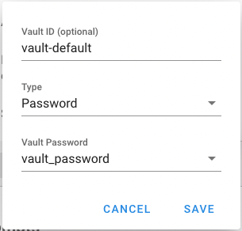
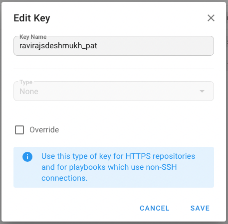
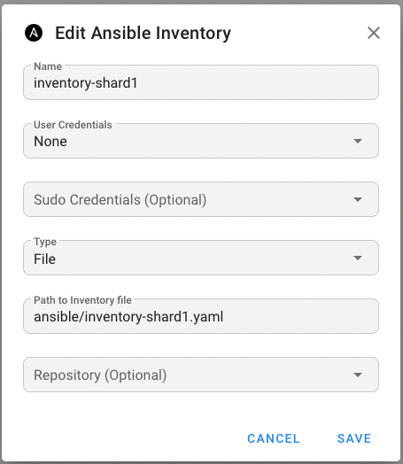
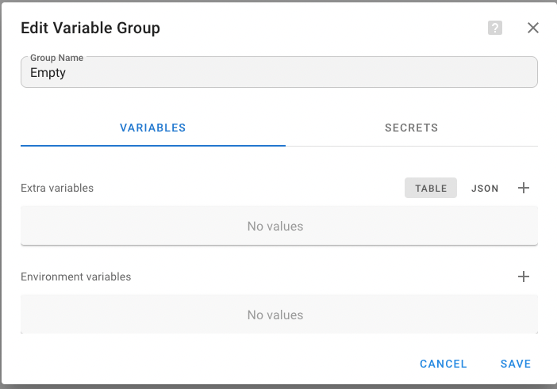
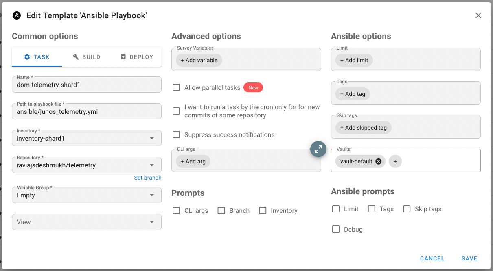
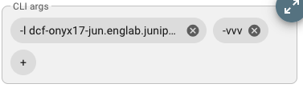

# Semaphore UI Configuration Guide

This guide walks through configuring Semaphore UI for running telemetry collection tasks across multiple device shards.

## Prerequisites

Before starting configuration, ensure:
- ✅ Control plane is deployed and running
- ✅ All runners (runner01-05) are registered and connected
- ✅ Semaphore UI is accessible at http://10.221.80.101:3001
- ✅ All runners show "a few seconds ago" in the Activity column
- ✅ You have admin credentials (default: `admin` / `changeme`)

## Overview

The telemetry collection system uses a sharded architecture where each shard targets a specific subset of devices:

| Shard | Devices | Inventory File |
|-------|---------|----------------|
| Shard 1 | XAI, Regression1 | inventory-shard1.yaml |
| Shard 2 | Regression2 | inventory-shard2.yaml |
| Shard 3 | TBD | inventory-shard3.yaml |
| Shard 4 | TBD | inventory-shard4.yaml |
| Shard 5 | TBD | inventory-shard5.yaml |

**Note**: In Semaphore Community Edition, you cannot manually assign tasks to specific runners. The control plane automatically distributes tasks among available runners (runner01-05) for parallel execution.

## 1. Create Project

### Step 1.1: Access Projects

1. Open Semaphore UI: http://10.221.80.101:3001
2. Login with credentials (default: `admin` / `changeme`)
3. Click **"New Project"** button on the dashboard

### Step 1.2: Configure Project Settings

Fill in the project details:

```
Project Name: Junos Telemetry Collection
```

**Important Settings:**
- **Name**: `Junos Telemetry Collection` (or your preferred name)
- **Alert**: Enable if you want email notifications on task failures
- **Max Parallel Tasks**: `5` (allows all shards to run simultaneously)

### Step 1.3: Save Project

1. Click **"Create"** button
2. You'll be redirected to the project dashboard
3. Note the project is now listed on the main dashboard

## 2. Configure Key Store

The Key Store securely manages SSH credentials and vault passwords needed to access Junos devices.

### Step 2.1: Access Key Store

1. From the project dashboard, click **"Key Store"** in the left sidebar
2. Click **"New Key"** button

### Step 2.2: Add Vault Password for Ansible Vault

Create a vault password key that will be used to decrypt Ansible vault files containing sensitive credentials.

```
Name: vault_password
Type: Login with password
Login (optional): [leave empty]
Password: <your-vault-password>
```

**Details:**
- **Name**: `vault_password` (exact name matters - referenced in tasks)
- **Type**: Select "Login with password"
- **Password**: Enter the same password used in `ansible/vault/vault_password`

Click **"Create"** to save.

### Step 2.3: Create Vault for Task Templates

Create a vault configuration that will be attached to task templates for decrypting vault files during playbook execution.

1. Still in the Key Store section, click **"New Key"** button again
2. Configure the vault:

```
Vault ID (optional): vault-default
Type: Password
Vault Password: vault_password
```

**Details:**
- **Vault ID**: `vault-default` (this identifies the vault in task templates)
- **Type**: Select "Password"
- **Vault Password**: Select `vault_password` (the key created in Step 2.2)



Click **"Save"** to create the vault.

### Step 2.4: Add GitHub PAT (Personal Access Token)

Add a GitHub Personal Access Token to allow Semaphore to access the repository over HTTPS. Since the repository `https://github.com/ravirajsdeshmukh/telemetry` is currently public, you can create a key with "None" type as authentication is not required.

```
Name: ravirajsdeshmukh_pat
Type: None
```

**Details:**
- **Name**: `ravirajsdeshmukh_pat` (or any descriptive name)
- **Type**: Select "None" (for public repositories)
- **Note**: For private repositories, select "Login with password" and provide a valid GitHub PAT



Click **"Create"** to save.

### Step 2.5: Verify Keys

After adding all keys, you should see them listed in the Key Store:
- ✅ vault_password (Login with password)
- ✅ vault-default (Vault - Password)
- ✅ ravirajsdeshmukh_pat (GitHub PAT) 

## 3. Create Inventories

Each shard needs its own inventory configuration pointing to the correct device inventory file. Inventories define which devices each task will target.

### Step 3.1: Access Inventory Settings

1. From the project dashboard, click **"Inventory"** in the left sidebar
2. Click **"New Inventory"** button

### Step 3.2: Create Inventory for Shard 1

Configure the inventory with these values:

```
Name: Shard 1 - XAI and Regression1
User Credentials: None
Sudo Credentials: None
Type: File
Inventory: inventory-shard1.yaml
SSH Key: ravirajsdeshmukh_pat
Become Key: None
```

**Field Details:**
- **Name**: Descriptive name for this shard (e.g., "Shard 1 - XAI and Regression1")
- **User Credentials**: Select "None" - device credentials are managed in Ansible vault files
- **Sudo Credentials**: Select "None" - not required for Junos devices
- **Type**: Select **"File"** from the dropdown
- **Inventory**: Enter exact filename `inventory-shard1.yaml`
  - This file must exist in the `ansible/` directory of your repository
  - Path is relative to the Ansible playbook location
  - Each shard has a dedicated inventory file filtering specific devices
- **SSH Key**: Select **"ravirajsdeshmukh_pat"** - the GitHub PAT created earlier for repository access
- **Become Key**: Select "None" - privilege escalation not needed



Click **"Create"** to save.

### Step 3.3: Create Inventories for Remaining Shards

Repeat the same process for Shards 2-5, using these inventory filenames:

| Shard | Name | Inventory File |
|-------|------|----------------|
| Shard 2 | Shard 2 - Regression2 | inventory-shard2.yaml |
| Shard 3 | Shard 3 - TBD | inventory-shard3.yaml |
| Shard 4 | Shard 4 - TBD | inventory-shard4.yaml |
| Shard 5 | Shard 5 - TBD | inventory-shard5.yaml |

**Note**: All other fields remain the same as Shard 1:
- User Credentials: None
- Sudo Credentials: None  
- Type: File
- SSH Key: ravirajsdeshmukh_pat
- Become Key: None

### Step 3.4: Verify Inventories

After creating all inventories, you should see 5 entries in the Inventory list:
- ✅ Shard 1 - XAI and Regression1 (File: inventory-shard1.yaml)
- ✅ Shard 2 - Regression2 (File: inventory-shard2.yaml)
- ✅ Shard 3 - TBD (File: inventory-shard3.yaml)
- ✅ Shard 4 - TBD (File: inventory-shard4.yaml)
- ✅ Shard 5 - TBD (File: inventory-shard5.yaml)

## 4. Create Task Templates

Task templates define what command to run, which inventory to use, and which runner should execute the task.

### Step 4.1: Create Empty Environment Variable Group

Before creating task templates, you must first create an environment variable group (even if empty, as it's a mandatory field).

1. From the project dashboard, click **"Environment"** in the left sidebar
2. Click **"New Environment"** button
3. Configure as follows:

```
Group Name: Empty
Extra variables: [leave empty]
Environment variables: [leave empty]
```



Click **"Save"** to create the empty environment group.

**Note**: While this group is empty, it's required for task template creation. You can add environment-specific variables here later if needed.

### Step 4.2: Access Task Templates

1. From the project dashboard, click **"Task Templates"** in the left sidebar
2. Click **"New Template"** button

### Step 4.3: Create Template for Shard 1

#### Common Options (TASK tab)

```
Name: Collect Telemetry - Shard 1
Path to playbook file: ansible/junos_telemetry.yml
Inventory: Shard 1 - XAI and Regression1
Repository: ravirajsdeshmukh/telemetry
Variable Group: Empty
View: [leave default]
```

**Field Details:**
- **Name**: Descriptive name for this task template
- **Path to playbook file**: `ansible/junos_telemetry.yml` (relative path from repository root)
- **Inventory**: Select "Shard 1 - XAI and Regression1" (created in Step 3.2)
- **Repository**: Enter `ravirajsdeshmukh/telemetry` (your GitHub repository)
- **Variable Group**: Select "Empty" (created in Step 4.1)
- **View**: Leave as default

#### Ansible Options

In the right panel under **"Vaults"** section:

1. Click **"+ Add vault"** (the plus icon next to "Vaults")
2. Select **"vault-default"** from the dropdown

This attaches the vault configuration to decrypt Ansible vault files during playbook execution.



#### Advanced Options

**Survey Variables:**
```
[leave empty]
```

**Allow parallel tasks:** [unchecked]

**CLI args:**

Click **"+ Add arg"** and add:
```
--vault-password-file=/tmp/vault_password
```

**Optional - For debugging/testing:**

To run in verbose mode for a single device, add additional CLI args:
```
-l dcf-onyx17-jun.englab.juniper.net,localhost
-vvv
```

**Important Notes:**
- When using `--limit` (or `-l`), always include `localhost` to ensure the timestamp initialization and hourly Parquet aggregation plays execute
- **Always limit to one device when using verbose mode** (`-vvv`) - running verbose mode against multiple devices generates excessive log output that can cause Semaphore UI to hang when viewing task logs
- Remove these debugging arguments for normal scheduled operations



**Tags:** [leave empty]

**Skip tags:** [leave empty]

#### Ansible Prompts

Leave all prompts unchecked:
- [ ] CLI args
- [ ] Branch
- [ ] Inventory
- [ ] Limit
- [ ] Tags
- [ ] Skip tags
- [ ] Debug

Click **"Create"** to save.

**Note**: In Semaphore Community Edition, runner selection is not available. Tasks are automatically distributed across available runners (runner01-05) by the control plane, enabling parallel execution.

### Step 4.4: Create Templates for Remaining Shards

Repeat the same process for Shards 2-5. The key differences for each shard:

| Shard | Template Name | Inventory |
|-------|---------------|--------|
| Shard 2 | Collect Telemetry - Shard 2 | Shard 2 - Regression2 |
| Shard 3 | Collect Telemetry - Shard 3 | Shard 3 - TBD |
| Shard 4 | Collect Telemetry - Shard 4 | Shard 4 - TBD |
| Shard 5 | Collect Telemetry - Shard 5 | Shard 5 - TBD |

**Note**: All other settings remain the same as Shard 1:
- Path to playbook file: `ansible/junos_telemetry.yml`
- Repository: `ravirajsdeshmukh/telemetry`
- Variable Group: `Empty`
- Vaults: `vault-default`
- CLI args: `--vault-password-file=/tmp/vault_password`

### Step 4.5: Verify Task Templates

You should now see 5 task templates:
- ✅ Collect Telemetry - Shard 1
- ✅ Collect Telemetry - Shard 2
- ✅ Collect Telemetry - Shard 3
- ✅ Collect Telemetry - Shard 4
- ✅ Collect Telemetry - Shard 5

### Step 4.6: Test Run (Manual)

Before creating schedules, test each template manually:

1. Click on a task template (e.g., "Collect Telemetry - Shard 1")
2. Click **"Run"** button
3. Monitor the task execution in real-time
4. Verify:
   - Task runs on correct runner (check logs)
   - Devices are accessible
   - Telemetry data is collected
   - Parquet files are created in `raw_ml_data/`
   - Metrics are pushed to Prometheus (if enabled)

Repeat for all 5 shards to ensure everything works before scheduling.

## 5. Create Schedules

Schedules automate task execution at specified intervals using cron expressions.

### Step 5.1: Access Schedules

1. From the project dashboard, click **"Schedules"** in the left sidebar (or "Scheduled Tasks")
2. Click **"New Schedule"** button

### Step 5.2: Create Schedule for Shard 1

```
Name: Shard 1 - Every 20 Minutes
Task Template: Collect Telemetry - Shard 1
Cron Format: */20 * * * *
Enabled: ✓ (checked)
```

**Field Details:**
- **Name**: Descriptive name for the schedule
- **Task Template**: Select "Collect Telemetry - Shard 1"
- **Cron Format**: `*/20 * * * *` (every 20 minutes)
  - Minute: `*/20` (every 20 minutes)
  - Hour: `*` (every hour)
  - Day of month: `*` (every day)
  - Month: `*` (every month)
  - Day of week: `*` (every day of week)
- **Enabled**: Check the box to activate

Click **"Create"** to save.

### Step 5.3: Create Schedule for Shard 2

```
Name: Shard 2 - Every 20 Minutes
Task Template: Collect Telemetry - Shard 2
Cron Format: */20 * * * *
Enabled: ✓
```

### Step 5.4: Create Schedule for Shard 3

```
Name: Shard 3 - Every 20 Minutes
Task Template: Collect Telemetry - Shard 3
Cron Format: */20 * * * *
Enabled: ✓
```

### Step 5.5: Create Schedule for Shard 4

```
Name: Shard 4 - Every 20 Minutes
Task Template: Collect Telemetry - Shard 4
Cron Format: */20 * * * *
Enabled: ✓
```

### Step 5.6: Create Schedule for Shard 5

```
Name: Shard 5 - Every 20 Minutes
Task Template: Collect Telemetry - Shard 5
Cron Format: */20 * * * *
Enabled: ✓
```

### Step 5.7: Verify Schedules

You should see 5 active schedules:
- ✅ Shard 1 - Every 20 Minutes (Enabled)
- ✅ Shard 2 - Every 20 Minutes (Enabled)
- ✅ Shard 3 - Every 20 Minutes (Enabled)
- ✅ Shard 4 - Every 20 Minutes (Enabled)
- ✅ Shard 5 - Every 20 Minutes (Enabled)

### Step 5.8: Monitor Scheduled Execution

1. Navigate to the project dashboard
2. You'll see tasks appearing automatically every 20 minutes
3. Each task will show:
   - Which runner executed it
   - Start and end time
   - Status (Running, Success, Failed)
   - Output logs

### Common Cron Schedule Examples

```bash
*/20 * * * *    # Every 20 minutes
*/5 * * * *     # Every 5 minutes
*/10 * * * *    # Every 10 minutes
*/15 * * * *    # Every 15 minutes
0 * * * *       # Every hour (at minute 0)
0 */2 * * *     # Every 2 hours
0 0 * * *       # Daily at midnight
0 0 * * 0       # Weekly on Sunday at midnight
```

## Verification and Monitoring

### Check Task Execution

1. **Dashboard View**: Monitor all running tasks from the main dashboard
2. **Task History**: Click on a task to see detailed logs and output
3. **Runner Activity**: Verify tasks are distributed across runners

### Verify Data Collection

```bash
# On control plane VM
cd /home/ubuntu/workspace/telemetry/infrastructure/mounts

# Check raw XML and JSON output
ls -lh output/

# Check Parquet files (ML data)
ls -lh raw_ml_data/dt=$(date +%Y-%m-%d)/hr=$(date +%H)/

# Check latest files
find raw_ml_data/ -name "*.parquet" -type f -mmin -10
```

### Monitor Prometheus Metrics

1. Open Prometheus: http://10.221.80.101:9090
2. Query examples:
   ```promql
   junos_optics_rx_power_dbm
   junos_optics_tx_power_dbm
   junos_interface_fec_ccw
   ```
3. Verify metrics are being updated every 5 minutes

### View in Grafana

1. Open Grafana: http://10.221.80.101:3000
2. Login (default: `admin` / `admin`)
3. Add Prometheus data source if not already configured
4. Create dashboards to visualize telemetry metrics

## Troubleshooting

### Issue: Task Fails with "Vault Password Required"

**Error:**
```
ERROR! Attempting to decrypt but no vault secrets found
```

**Solution:**
1. Verify vault_password is configured in Key Store
2. Check Extra CLI Arguments includes: `--vault-password-file=/tmp/vault_password`
3. Ensure vault password matches the one used to encrypt vault files

### Issue: Tasks Not Running in Parallel

**Symptom:** All tasks run sequentially instead of in parallel

**Solution:**
1. Check project settings: **Max Parallel Tasks** should be set to ≥ 5
2. Verify all runners are connected and active:
   - Go to **Settings** → **Runners**
   - Check that all 5 runners (runner01-05) show recent activity ("a few seconds ago")
3. Ensure all runners are healthy and not stuck

**Note**: In Semaphore Community Edition, you cannot manually assign tasks to specific runners. The control plane automatically distributes tasks across available runners. If all tasks run on one runner, it may indicate that other runners are not properly connected or registered.

### Issue: "Inventory File Not Found"

**Error:**
```
ERROR! the inventory file could not be found
```

**Solution:**
1. Verify inventory files exist in the `ansible/` directory:
   ```bash
   ls -la /home/ubuntu/workspace/telemetry/ansible/inventory-shard*.yaml
   ```
2. Check inventory name in Semaphore matches the actual filename
3. Ensure files are synced to runner VMs (automatic with deploy script)

### Issue: Schedule Not Running

**Checklist:**
- ✓ Schedule is **Enabled** (checkbox checked)
- ✓ Cron format is valid (test at https://crontab.guru)
- ✓ Task template is correctly selected
- ✓ Wait for the next scheduled time (schedules don't run immediately on creation)

### Issue: Only One Task Runs at a Time

**Symptom:** Tasks wait in queue instead of running in parallel

**Solution:**
1. Check project settings: **Max Parallel Tasks** should be set to ≥ 5
2. Ensure all runners are connected and active (Settings → Runners → Activity column)
3. Verify that no runner is stuck executing a long-running task
4. Check that the "Allow parallel tasks" option is not enabled on individual task templates (this forces sequential execution)

## Advanced Configuration

### Environment-Specific Configurations

For different environments (dev, staging, prod), create separate:
- Projects (e.g., "Telemetry - Development", "Telemetry - Production")
- Inventories (pointing to different device sets)
- Task templates (with environment-specific variables)
- Schedules (different intervals per environment)

### Custom Variables

Add custom variables to task templates for flexibility:

```
Environment Variables:
  PROMETHEUS_PUSHGATEWAY: http://10.221.80.101:9091
  ANSIBLE_HOST_KEY_CHECKING: False
  OUTPUT_DIR: /tmp/semaphore/output
  S3_BUCKET: amzn-ds-s3-rrd
  S3_PREFIX: datalake
```

### Notification Alerts

Configure email alerts for task failures:

1. Go to Project Settings
2. Enable **"Alert on Task Failure"**
3. Configure SMTP settings in Semaphore configuration
4. Add recipient email addresses

### Task Dependencies

Create task chains where one task triggers another:
1. Create a "parent" task template
2. Create a "child" task template
3. In parent template, add CLI argument: `--extra-vars "trigger_next_task=true"`
4. Use Semaphore API or webhooks to trigger child task

## Next Steps

Once configuration is complete:

1. **Monitor Initial Runs**: Watch the first few scheduled executions closely
2. **Verify Data Quality**: Check Parquet files and Prometheus metrics
3. **Set Up Dashboards**: Create Grafana dashboards for visualization
4. **Configure Alerts**: Set up alerts for device failures or metric anomalies
5. **Optimize Schedules**: Adjust intervals based on data needs and system load

## Related Documentation

- [DEPLOYMENT_GUIDE.md](DEPLOYMENT_GUIDE.md) - Infrastructure deployment
- [../docs/SEMAPHORE_SETUP.md](../docs/SEMAPHORE_SETUP.md) - Additional Semaphore configuration
- [../docs/ANSIBLE_VAULT_SETUP.md](../docs/ANSIBLE_VAULT_SETUP.md) - Vault credential management
- [../README.md](../README.md) - Project overview and Ansible playbook usage
